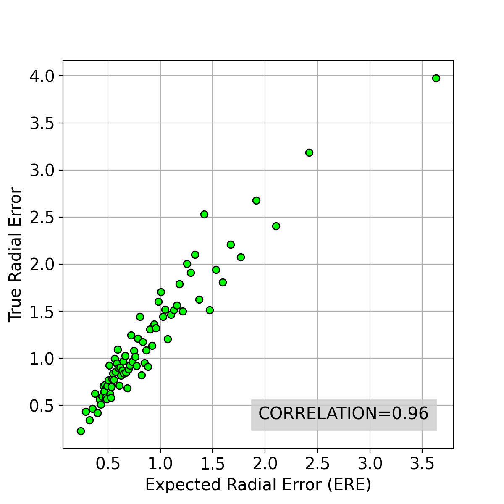
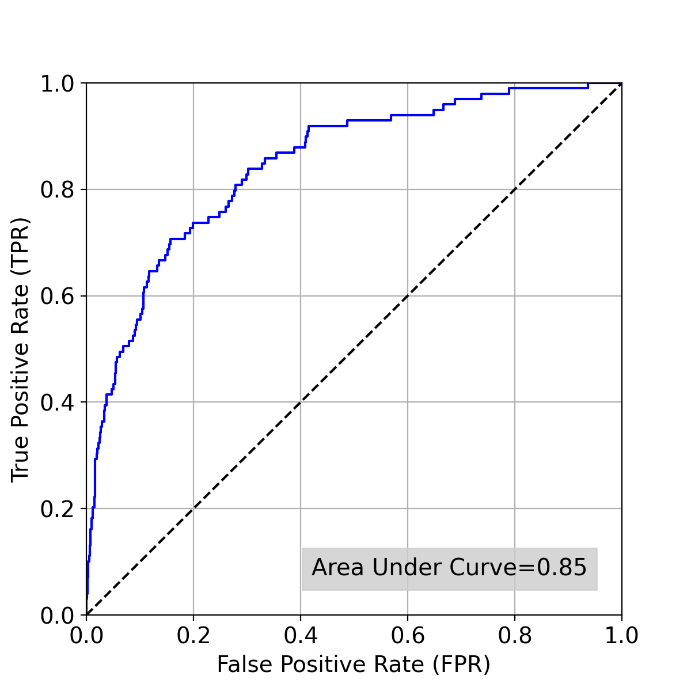
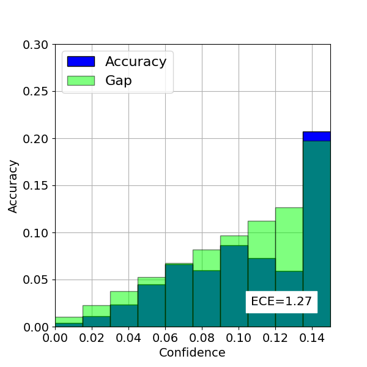

# 🦴 Landmark Detection System — Cephalometric X-Ray Analysis

Reproduction of the **Contour Hugging Heatmaps** research paper for anatomical landmark detection on cephalometric X-ray images. Built using PyTorch with temperature scaling for model calibration. Validated against published benchmarks using Mean Radial Error (MRE) and Successful Detection Rate (SDR).


---

## 📌 Project Overview

This project independently reproduces the experiments from:

> **"Contour Hugging Heatmaps for Landmark Detection"**

Key contributions:
- Deep learning landmark detection on **400 cephalometric X-ray images**
- **19 clinical landmarks** detected per image
- **Temperature scaling** applied to minimize Estimated Calibration Error (ECE)
- Validated using **Mean Radial Error (MRE)** and **Successful Detection Rate (SDR)**

---

## 🏗️ System Architecture

```
┌─────────────────────────────────────────────┐
│           Input: X-Ray Images                │
│         ISBI 2015 Dataset (400 images)       │
└──────────────────┬──────────────────────────┘
                   │
        ┌──────────▼──────────┐
        │   Data Preprocessing │
        │  landmark_dataset.py │
        └──────────┬──────────┘
                   │
        ┌──────────▼──────────┐
        │   Model Training     │
        │     train.py         │
        │  Contour Hugging     │
        │  Heatmap Network     │
        └──────────┬──────────┘
                   │
        ┌──────────▼──────────┐
        │ Temperature Scaling  │
        │temperature_scaling.py│
        │  Minimizes ECE       │
        └──────────┬──────────┘
                   │
        ┌──────────▼──────────┐
        │     Evaluation       │
        │      test.py         │
        │   MRE + SDR Metrics  │
        └──────────┬──────────┘
                   │
        ┌──────────▼──────────┐
        │   Results & Plots    │
        │      plots.py        │
        └─────────────────────┘
```

---

## 🛠️ Tech Stack

| Component | Technology |
|---|---|
| Language | Python 3.7+ |
| Deep Learning | PyTorch 1.10.0 |
| GPU Acceleration | CUDA 11.3 + cuDNN |
| Dataset | ISBI 2015 Cephalometric |
| Calibration | Temperature Scaling |
| Evaluation | MRE, SDR, ECE |
| Config | YAML |

---

## 📊 Dataset

**ISBI 2015 Cephalometric X-Ray Dataset**

| Split | Images | Purpose |
|---|---|---|
| Training | 150 images (001–150) | Model training |
| Test Set 1 | 150 images (151–300) | Temperature scaling |
| Test Set 2 | 100 images (301–400) | Final evaluation |
| **Total** | **400 images** | **19 landmarks each** |

Download the dataset from:
```
http://www-o.ntust.edu.tw/~cweiwang/ISBI2015/challenge1/
```

---

## 📋 Requirements

- Python 3.7+
- CUDA 11.3 + cuDNN
- NVIDIA GPU with 8GB+ VRAM
- See `requirements.txt` for full package list

---

## ⚙️ Installation

```bash
# 1. Clone the repository
git clone https://github.com/yogendravarmaa7/landmark-detection-system.git
cd landmark-detection-system

# 2. Create virtual environment
python3 -m venv venv
source venv/bin/activate  # Windows: venv\Scripts\activate

# 3. Install dependencies
pip install --upgrade pip
pip install -r requirements.txt
```

---

## 📁 Dataset Preparation

Extract the dataset so the file structure looks like this:

```
{cephalometric_data_directory}
├── AnnotationsByMD
│   ├── 400_junior
│   │   ├── 001.txt
│   │   └── ...
│   └── 400_senior
│       ├── 001.txt
│       └── ...
└── RawImage
    ├── TrainingData
    │   ├── 001.bmp
    │   └── ...
    ├── Test1Data
    │   ├── 151.bmp
    │   └── ...
    └── Test2Data
        ├── 301.bmp
        └── ...
```

---

## 🚦 Usage

### Step 1 — Train the Model
```bash
python train.py --cfg experiments/cephalometric.yaml \
  --training_images {data_dir}/RawImage/TrainingData/ \
  --annotations {data_dir}/AnnotationsByMD/
```
Saves model at `output/cephalometric/cephalometric_model.pth` after 15 epochs.

### Step 2 — Temperature Scaling
```bash
python temperature_scaling.py --cfg experiments/cephalometric.yaml \
  --fine_tuning_images {data_dir}/RawImage/Test1Data/ \
  --annotations {data_dir}/AnnotationsByMD/ \
  --pretrained_model output/cephalometric/cephalometric_model.pth
```
Saves calibrated model at `output/cephalometric/cephalometric_scaled_model.pth`.

### Step 3 — Test & Evaluate
```bash
python test.py --cfg experiments/cephalometric.yaml \
  --testing_images {data_dir}/RawImage/Test2Data/ \
  --annotations {data_dir}/AnnotationsByMD/ \
  --pretrained_model output/cephalometric/cephalometric_scaled_model.pth
```
Outputs **MRE** and **SDR** statistics.

---

## 📈 Results

The model outputs the following evaluation graphs saved in `output/cephalometric/`:

### Expected Radial Error vs True Radial Error


### Receiver Operating Characteristic Curve


### Reliability Diagram


---

## 📁 Project Structure

```
landmark-detection-system/
│
├── experiments/
│   └── cephalometric.yaml    # Training configuration
│
├── figures/
│   ├── re_vs_ere_correlation_graph.png
│   ├── roc_outlier_graph.png
│   └── reliability_diagram.png
│
├── config.py                 # Configuration parser
├── evaluate.py               # Evaluation metrics (MRE, SDR)
├── landmark_dataset.py       # Dataset loader and preprocessing
├── model.py                  # Contour Hugging Heatmap network
├── plots.py                  # Result visualization
├── temperature_scaling.py    # Model calibration
├── test.py                   # Testing and evaluation script
├── train.py                  # Training script
├── utils.py                  # Utility functions
├── requirements.txt
└── README.md
```

---

## 📚 Reference

This project reproduces experiments from:

```
@article{contourhugging2022,
  title={Contour Hugging Heatmaps for Landmark Detection},
  journal={ISBI 2015 Cephalometric Challenge}
}
```

Dataset citation:
```
@article{wang2016benchmark,
  title={A benchmark for comparison of dental radiography analysis algorithms},
  author={Wang, Ching-Wei et al.},
  journal={Medical image analysis},
  volume={31},
  pages={63--76},
  year={2016},
  publisher={Elsevier}
}
```

---
## 🔮 Future Enhancements

- Extended to additional anatomical landmark datasets
- Integration with clinical imaging pipelines
- Real-time inference optimization
- Web-based visualization dashboard

---

## 👤 Author

**Yogendra Varma Addepalli**
- 🌐 Portfolio: yogendravarmaa7.github.io
- 💼 LinkedIn: linkedin.com/in/yaddepalli
- 📧 Email: addepalliyogendravarma@gmail.com


---
